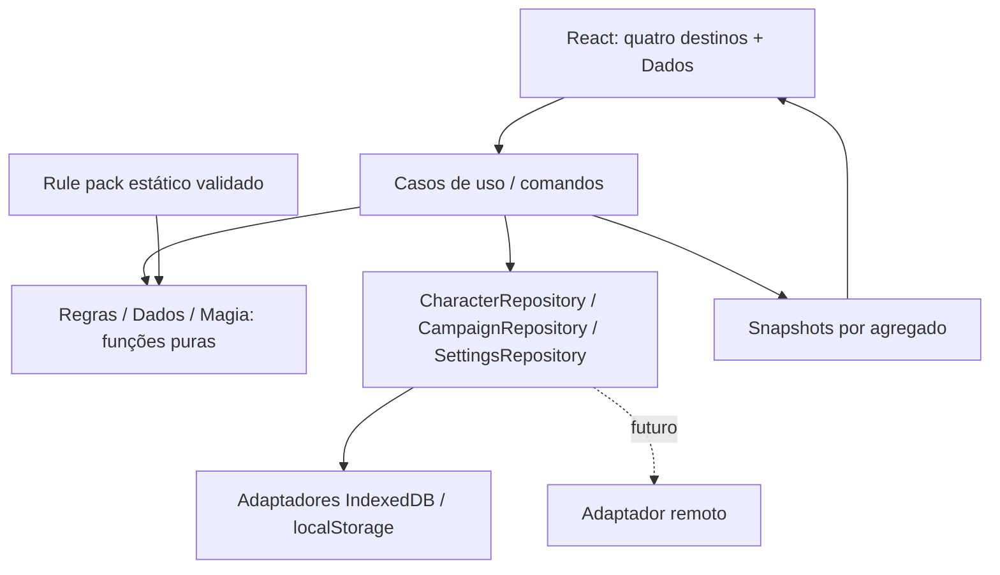

# 03 — Arquitetura

## Fronteiras

Setas representam dependência/fluxo permitido. Domínio não importa React, store, IndexedDB, DOM, rede, relógio global ou APIs de plataforma. Interfaces dos repositórios pertencem à camada de aplicação; adaptadores as implementam. A composição injeta dependências.

## Organização futura, não criada nesta etapa

| Caminho | Responsabilidade | Não deve conter |
| --- | --- | --- |
| `src/app/` | Bootstrap, rotas, providers e composição | Fórmulas de RPG |
| `src/domain/contracts/` | Tipos compartilhados, IDs e erros | Componentes e IO |
| `src/domain/rules/` | Derivações, condições e combate | Persistência |
| `src/domain/dice/` | Validação e avaliação de dados com RNG injetável | Animação |
| `src/domain/spells/` | Elegibilidade e resolução de conjuração | Regras copiadas de cards |
| `src/application/` | Comandos, filas, portas e coordenação de transações | JSX |
| `src/data/` | Definitions estáticas e manifesto de pack | PV atual de alguém |
| `src/infrastructure/` | IndexedDB, arquivos de backup, caches | Regra de nível de classe |
| `src/application/state/` | Snapshots observáveis por agregado | Segunda cópia independente da ficha |
| `src/features/` | Personagem, ações, jornada, compêndio, dados e configurações | Acesso direto ao banco |
| `src/components/` | UI, layout, cards e feedback reutilizáveis | Regras específicas ocultas |

Os caminhos exatos de trabalho pertencem ao [ownership](swarm/OWNERSHIP.md). Alteração de contrato vem antes do consumidor. Uma abstração só entra quando separa uma dependência real; não criar generic repository, event bus global ou linguagem arbitrária de fórmulas na V1.

## Stack e estado

React + TypeScript + Vite planejados; roteamento por React Router. Nenhuma instalação nesta entrega. Versões compatíveis serão fixadas no passo de fundação; não há número de versão presumido.

Decisão: external store pequeno por agregado, consumido por `useSyncExternalStore`; snapshots imutáveis e assinatura estável. Context injeta repositórios, personagem ativo e coordenador de overlays. Formulários usam estado local; rascunhos necessários à recuperação persistem separados. Server State inexistente. Esta escolha evita nova biblioteca de estado; reavaliar por ADR se complexidade comprovada justificar. Contrato do hook: [React](https://react.dev/reference/react/useSyncExternalStore).

Persistência é fonte durável; store é snapshot em memória com estado de gravação, nunca banco paralelo. Navegar desmonta views, não destrói o agregado nem cancela gravação já aceita. Consultas derivadas selecionam apenas campos necessários; mudança de diário não renderiza toda ficha.

## Fluxo de mutação

`intenção → validar contrato → carregar revisão → resolver regra → confirmar escolhas → persistir transação com revisão esperada → publicar snapshot → feedback`.

HP, slots, recursos e inventário exigem gravação imediata, serializada por personagem. Campos narrativos podem mostrar edição otimista e debounce; nunca dizer “salvo” antes de `transaction.complete`. Falha preserva rascunho e permite repetir sem duplicar consumo. [Persistência](08-PERSISTENCIA-LOCAL.md).

## Backend futuro

UI e regras permanecem iguais. Um adaptador remoto pode implementar as mesmas operações assíncronas, conflito por revisão e erros tipados. Identidade de usuário, autorização, sincronização e política de conflitos remotos exigirão ADR próprio; interfaces locais não prometem resolver essas questões antecipadamente. `SupabaseCharacterRepository` é exemplo futuro, não dependência.

## Performance e fronteira de cache

Carregar shell + personagem ativo primeiro; índices do compêndio separados das descrições. Rotas secundárias lazy, imagens com dimensões limitadas e miniaturas, histórico paginado. Para offline completo, uma etapa posterior baixa e valida todos os chunks necessários: lazy rendering não significa depender da rede durante sessão. Só anunciar “pronto offline” após essa etapa.

Metas de produto a validar em aparelho intermediário: interação local até 100 ms percebidos; busca até 200 ms em catálogo carregado; nenhum mapa bloqueia rolagem; sem tarefa longa repetitiva na thread principal. São orçamentos de projeto, não garantias medidas nesta etapa.

## Orquestração de trabalho

O agente principal é o orquestrador do projeto. A política de delegação, os modelos permitidos, o limite de três subagentes Codex, a profundidade máxima 1 e a lane Claude Code via MCP estão definidos no [ADR-0006](decisoes/ADR-0006-orquestracao-agentes.md). Codebase Memory deve ser consultado primeiro para descoberta estrutural; owners e dependências continuam governados pelo [swarm](swarm/README.md).
