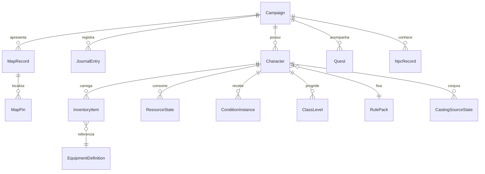

# 09 — Modelo de dados conceitual

Contrato canônico detalhado: [schemas](dados/schemas.md). Exemplos são especificação, não implementação.

## Separação fundamental

| Imutável, pertence ao pack | Mutável, pertence ao jogador |
| --- | --- |
| `RaceDefinition`, `SubraceDefinition` | Raça escolhida e escolhas concedidas |
| `ClassDefinition`, `SubclassDefinition` | Níveis por classe, subclasse e escolhas por nível |
| `SpellDefinition` | Magias conhecidas/preparadas, grimório, espaços gastos |
| `EquipmentDefinition` | Instância, quantidade, equipada, notas e consumo |
| `ConditionDefinition` | Aplicação, origem, duração e nível de exaustão |
| `ResourceDefinition` | Capacidade resolvida e quantidade gasta |
| Tabela de XP e progressão | XP concedido e histórico de avanço |

Não salvar modificador de atributo, CA ou CD como valor editável principal. Salvar entradas, escolhas e ajustes explícitos com justificativa; derivar resultado e explicação. Cache de derivação é descartável e identificado pela revisão do personagem + versão exata do pack.

## Agregados e relações

Personagem pode existir sem campanha; no máximo uma campanha proprietária na V1. Uma campanha agrega vários personagens locais, sem presumir vários usuários. NPC narrativo não precisa ser ficha completa. IDs de notas/locais permitem referências; texto de notas não é chave.

## Identidade e versionamento

`rulesetRef = {id, version}` fixa a versão; `DefinitionRef = {rulesetId, entityId}` resolve apenas dentro dessa versão. IDs como `druid`, `human`, `cure-wounds` não mudam com tradução. Estado usa UUID gerado na criação. Reordenação de catálogos não altera saves. [IDs](dados/ids.md).

Quatro versões distintas: `schemaVersion` do payload persistido; versão inteira do banco IndexedDB; `ruleset.version`; `appVersion`/build. Incrementar uma não incrementa automaticamente as demais. Atualizar pack nunca recalcula personagem silenciosamente: comparar efeitos, migrar cópia, aceitar explicitamente.

## Unidades e valores

Níveis, quantidades e contadores: inteiros finitos. XP ≥ 0. Distância interna em centímetros, peso em gramas, preço em peças de cobre inteiras; converter apresentação para metros, kg e moedas. Valores canônicos vêm do PDF em português, sem reconverter automaticamente medidas inglesas. Valores fracionários de ND usam numerador/denominador ou enum fechado, sem comparação por string.

PV atuais entre 0 e máximo da camada; temporários ≥ 0. Dano remanescente não é descartado antes de avaliar morte/transformação. Espaços e recursos usam `spent` e capacidade derivada, sem salvar também `remaining` independente. Capacidade que diminui mantém gasto histórico e mostra disponível `max(0, capacity-spent)`; não transforma atualização de regra em recuperação de recurso.

## Limites de confiança

JSON importado é entrada não confiável: validar tipos, limites, referências, pack, integridade de arquivos e colisões antes de escrever. Strings narrativas são texto simples; nenhuma fórmula executável, HTML arbitrário ou URL de imagem remota vira código. Conteúdo desconhecido fica em quarentena recuperável. [Importação](dados/persistencia.md).
