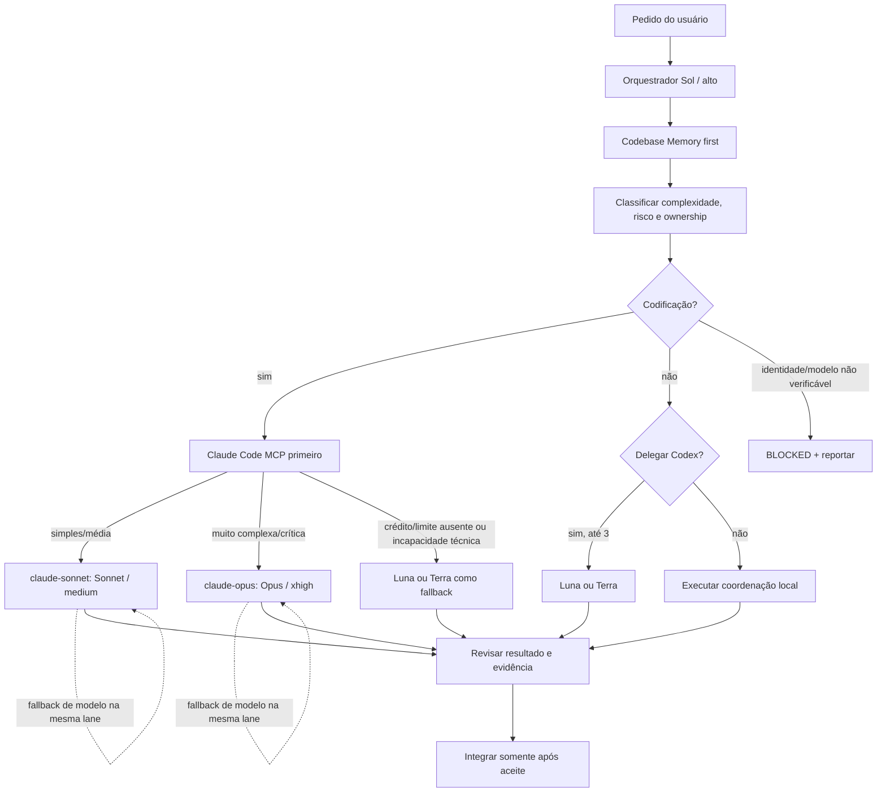

# ADR-0006 — Orquestração de agentes

## Status

Aceito para a fase de planejamento e para a implementação dos 20 passos. Este ADR define operação futura; não indica que software foi criado.

## Contexto

O trabalho terá um único ponto de coordenação: o agente principal, operando como orquestrador. A coordenação precisa manter escopo, contratos, ownership, dependências e evidência de aceite sob controle enquanto delega trabalho independente.

## Decisão

O orquestrador usa GPT-5.6 Sol com raciocínio alto como política-alvo do projeto. Ele lê o protocolo do swarm, consulta Codebase Memory primeiro para descoberta estrutural e decide se uma tarefa deve ser feita localmente ou delegada. O orquestrador não implementa em paralelo com agentes nem deixa agentes alterarem arquivos de outro owner.

Para agentes Codex, o limite é de três subagentes simultâneos, profundidade máxima 1. São permitidos somente os modelos ChatGPT Luna e ChatGPT Terra. O orquestrador escolhe modelo e nível de raciocínio conforme complexidade, risco, tamanho e dependências da tarefa. Sol e Astra são proibidos para subagentes, inclusive como fallback. Cada delegação deve informar objetivo, arquivos autorizados, critérios de aceite, evidência esperada e dependências; o resultado volta ao orquestrador para revisão e integração.

Para qualquer tarefa de codificação, Claude Code via MCP é a primeira opção. Há duas lanes explícitas, usando a cópia estável `mcp-agents 0.30.0`: `claude-sonnet` usa Sonnet com raciocínio `medium` para tarefas simples/médias; `claude-opus` usa Opus com raciocínio `xhigh` para tarefas muito complexas, críticas, ambíguas ou interdisciplinares. Esses são os únicos modelos permitidos nessa integração. Luna/Terra só são fallback quando Claude estiver sem crédito/limite ou tecnicamente incapaz; o motivo e a evidência entram no handoff. O spawn, acompanhamento, cancelamento e coleta de resultado usam o MCP, respeitando protocolo e owner. Fallback de modelo dentro da lane só ocorre após falha operacional documentada, sem trocar de servidor ou lane; se identidade, modelo ou nível de raciocínio não puderem ser selecionados ou verificados, a lane fica BLOCKED e a limitação é reportada.

O Codebase Memory é a primeira fonte para localizar símbolos, chamadas, arquitetura e ownership de código quando estiver disponível. `rg`/leitura direta ficam para strings, configuração, documentação ou quando o grafo for insuficiente. Descoberta não autoriza alteração: edição continua limitada aos arquivos atribuídos.

Até os 20 passos estarem concluídos, esta política é padrão. Mudança de limite, modelo, profundidade ou papel exige novo ADR.

## Fluxo operacional

## Consequências

- O orquestrador concentra decisões, revisão e comunicação com o usuário.
- A concorrência Codex fica limitada a três agentes e evita cascata de spawn.
- A seleção de modelo é explícita e auditável por tarefa.
- Fallback Codex só ocorre por crédito/limite Claude ausente ou incapacidade técnica, sempre documentado; fallback de modelo mantém a lane Claude e não troca servidor. Identidade/modelo/raciocínio não verificáveis permanecem bloqueados.
- O custo é maior coordenação e necessidade de evidência por delegação.
- Nenhuma implementação, dependência ou configuração de produção é criada por este ADR.

## Evidência e referências

- [Protocolo do swarm](../swarm/AGENT-PROTOCOL.md)
- [Ownership](../swarm/OWNERSHIP.md)
- [Dependências](../swarm/DEPENDENCIES.md)
- [Decisões de integração](../swarm/DECISIONS.md)
- [Arquitetura](../03-ARQUITETURA.md)
