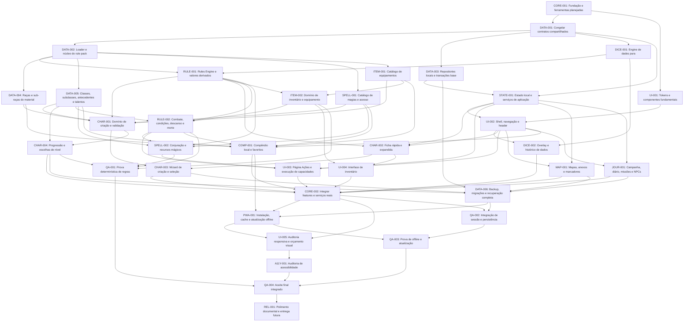

# Dependências e alocação

Fonte canônica: [TASKS](TASKS.md). Aresta A→B significa A deve estar DONE antes de B iniciar. Numeração dos 20 passos é leitura temática; não impõe ordem linear. DATA-001 estabelece contratos cedo; DATA-003 entrega persistência base antes do estado/shell/ficha; DATA-006 conclui a persistência. DICE-001 depende só do contrato e pode avançar cedo, sem UI ou banco.

## DAG completo

## Ondas de prontidão

A tabela assume que a onda anterior inteira terminou, apenas para planejamento. Na execução, liberar cada tarefa assim que seus próprios predecessores tiverem aceite, sem esperar barreira artificial. O cenário ativo é coordenador + até três subagentes Codex; coordenador não implementa produto. Colunas 4/6/8/12 são históricas/inativas até reavaliação e não autorizam reservas. A lane Claude é separada, sempre subordinada a ownership/DAG; este documento não lhe atribui limite de simultaneidade.

| Onda | Tarefas elegíveis quando predecessores forem DONE | Total | Ativo: 3 Codex | Histórico/inativo: 4 | Histórico/inativo: 6 | Histórico/inativo: 8 | Histórico/inativo: 12 |
| --- | --- | --- | --- | --- | --- | --- |
| 0 | CORE-001 | 1 | 1 | 1 | 1 | 1 | 1 |
| 1 | DATA-001, UI-001 | 2 | 2 | 2 | 2 | 2 | 2 |
| 2 | DATA-002, DATA-003, DICE-001 | 3 | 3 | 3 | 3 | 3 | 3 |
| 3 | DATA-004, DATA-005, ITEM-001, RULE-001, SPELL-001, STATE-001 | 6 | 3 | 4 | 6 | 6 | 6 |
| 4 | CHAR-001, ITEM-002, UI-002 | 3 | 3 | 3 | 3 | 3 | 3 |
| 5 | CHAR-002, CHAR-004, DICE-002, JOUR-001, MAP-001, RULE-002 | 6 | 3 | 4 | 6 | 6 | 6 |
| 6 | CHAR-003, COMP-001, SPELL-002, UI-004 | 4 | 3 | 4 | 4 | 4 | 4 |
| 7 | DATA-006, QA-001, UI-003 | 3 | 3 | 3 | 3 | 3 | 3 |
| 8 | CORE-002 | 1 | 1 | 1 | 1 | 1 | 1 |
| 9 | PWA-001, QA-002 | 2 | 2 | 2 | 2 | 2 | 2 |
| 10 | QA-003, UI-005 | 2 | 2 | 2 | 2 | 2 | 2 |
| 11 | A11Y-001 | 1 | 1 | 1 | 1 | 1 | 1 |
| 12 | QA-004 | 1 | 1 | 1 | 1 | 1 | 1 |
| 13 | REL-001 | 1 | 1 | 1 | 1 | 1 | 1 |

## Escalonamento de lanes

Capacidade operacional é de até três subagentes Codex simultâneos. Para tarefa simples/média, coordenador pode escalar para MCP `claude-sonnet` (Sonnet/medium; fallback de modelo Opus na própria lane); para complexa/crítica, MCP `claude-opus` (Opus/xhigh; fallback de modelo Sonnet na própria lane). Fallback não troca servidor/MCP. Ambos são leaves sob o mesmo ownership/handoff. Antes da execução, comprovar identidade/modelo efetivo; sem prova, lane Claude fica BLOCKED. Esta política não muda IDs, arestas, status ou prontidão do DAG.

- Cenário ativo: coordenador não implementa; reservar no máximo três tarefas Codex READY, disjuntas e compatíveis com ownership/DAG.
- Cenários 4/6/8/12: históricos/inativos até reavaliação; não orientam reserva, execução ou capacidade atual.

No estado atual, CORE-001, DATA-001, DATA-002, DATA-003, DATA-004, DATA-005, DICE-001, ITEM-001, RULE-001, UI-001 e STATE-001 estão DONE. UI-002 está em integração, DICE-002 em REVIEW e SPELL-001 em execução com Luna. Cada ID existe uma vez; dependências citam IDs existentes; “bloqueia” é inverso exato; nenhuma autorreferência/ciclo. Tasks consumidoras não redefinem contratos. Uma correção solicitada ao produtor é reabertura controlada, não aresta retroativa geradora de ciclo. Mocks não satisfazem predecessores nem checkpoints.
